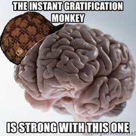

# *Welcome* to **my** new ***notes page*** version2

> Having a **Growth Mindset** is an improvement over my philosiphy that the only thing we really have any control of is our *attitude*.
>
> Also a *life long love of learning* is not enough just to say, but is something to ***DO***.
>
> **Growth Mindset** means to not just control my attitude but to understand where it's comming from.
> to monitor how my actions are affected by my body, mind, moods and thoughts.
>
> I also needed to think more about my responce to obsticals. I need to talk out the problem and give myself a chance to see a different avenue of approching it.
>
>If your a visual learner as i am, try [this!](https://soundcloud.com/atlassian-software/perseverance-gumption-traps-and-maintaining-a-growth-mindset)
>